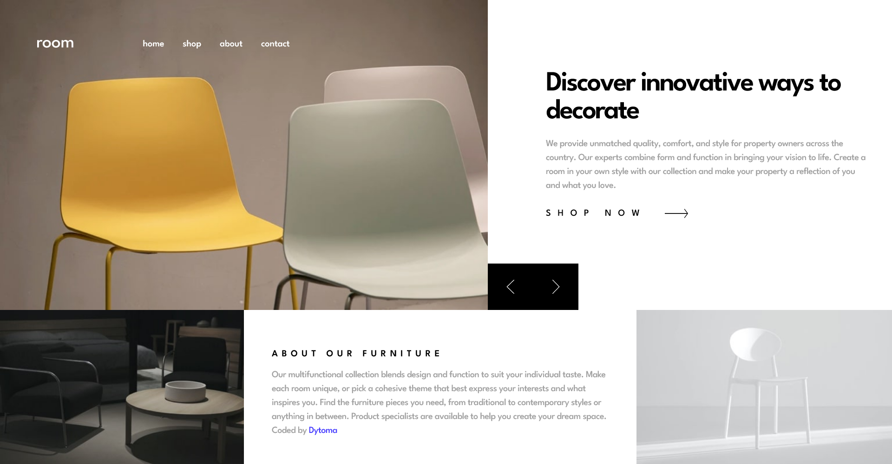

# Frontend Mentor - Room homepage solution

This is a solution to the [Room homepage challenge on Frontend Mentor](https://www.frontendmentor.io/challenges/room-homepage-BtdBY_ENq). Frontend Mentor challenges help you improve your coding skills by building realistic projects. 

## Table of contents

- [Overview](#overview)
  - [The challenge](#the-challenge)
  - [Screenshot](#screenshot)
  - [Links](#links)
- [My process](#my-process)
  - [Built with](#built-with)
- [Author](#author)

## Overview

**A room Homepage challenge.**

### The challenge

Users should be able to:

- View the optimal layout for the site depending on their device's screen size
- See hover states for all interactive elements on the page
- Navigate the slider using either their mouse/trackpad or keyboard

### Screenshot

This is a screenshot of my solution😇.

### Links

- Solution URL: [Solution URL](https://your-solution-url.com)
- Live Site URL: [Site URL](https://clever-concha-cb814a.netlify.app/)

## My process
For this project I used React, Tailwind CSS and react-awesome-reveal.

### Built with

- Semantic HTML5 markup
- CSS custom properties
- Flexbox
- CSS Grid
- Mobile-first workflow
- [React](https://reactjs.org/) - JS library
- [React-awesome-reveal](https://react-awesome-reveal.morello.dev/docs/getting-started) - React framework
- [Tailwind CSS](https://tailwindcss.com/) - For styles

## Author

- Frontend Mentor - [@Dytoma](https://www.frontendmentor.io/profile/Dytoma)
- Twitter - [@OmarDytoma](https://www.twitter.com/OmarDytoma)

